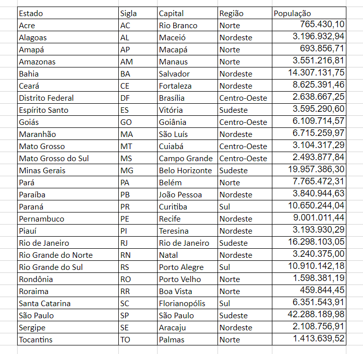
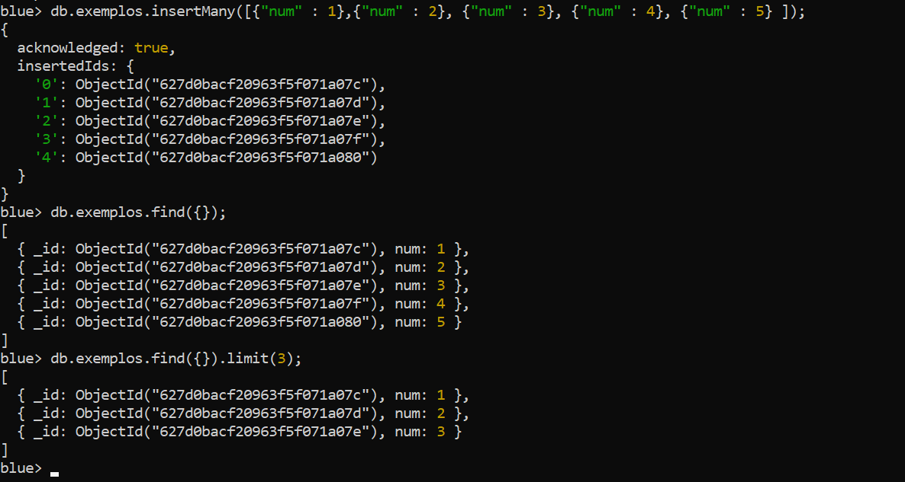

Aula ?? - [CODELAB] MongoDB - Parte 1

Vamos colocar em prática o aprendizado? Bom laboratório.

Vamos deixar uma primeira parte para revisão. Se for o primeiro contato de algumas pessoas com documents e bancos não relacionais, muitas dúvidas podem ter surgido. Aproveitamos também para revisar instalações e erros que possam ter surgido durante a aula. 

Exercícios

1. Inicialmente, gostaria que visitassem o exercício da primeira CodeLab. Lembram da modelagem? A proposta é replicar no MongoDB, mas detalhe. No banco relacional você normalizou entre várias tabelas, nosso desafio é criar uma collection para uma entidade e deixar os dados dentro um único documento;
2. Gere consultas no MongoDB semelhantes as querys do SQL e compare os scripts;
3. Faça seleções, filtros e atualizações de dados para praticar. Guarde estas consultas e salve em arquivos (pode ser em .txt);
4. Referente a atividade 3, quando for aplicável, guarde em arquivos as consultas SQL e o script Mongo;
5. Crie um database de modo que atenda a planilha abaixo e responda algumas perguntas de negócio.

  a) Salve estes dados em uma collection;
  
  b) Faça um filtro para cada Região;
  
  c) Faça uma ordenação por Nome do Estado;
  
  d) Faça uma ordenação por população;
  

6. Para o próximo desafio, veja o código abaixo.

<code> 
db.exemplos.insertMany([{"num" : 1},{"num" : 2}, {"num" : 3}, {"num" : 4}, {"num" : 5} ]);
  
db.exemplos.find({}).limit(3);
</code>

  a) Seu desafio será retornar os 5 estados com a maior população e depois os 5 com a menor população.
  
  b) Agora mostre uma lista com os 2 estados com maior população em cada região;
  
O print a seguir pode te dar uma ideia. 

