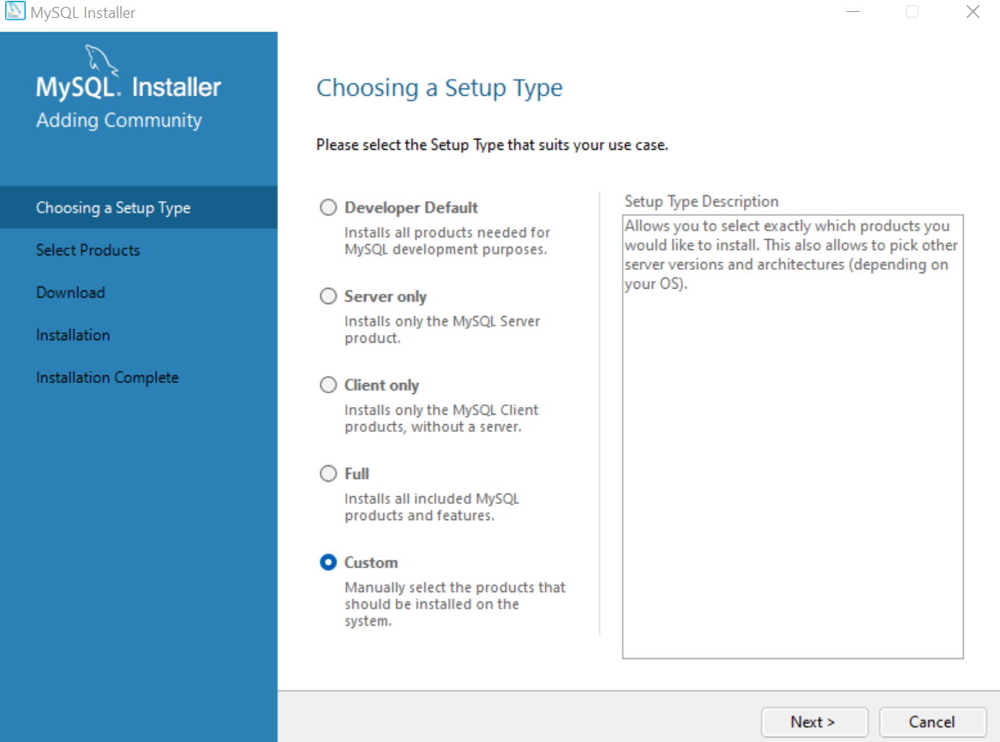

# # Aula 16 - [AULA] SQL - Parte 1

## Conteúdos

1. Conceitos iniciais de bancos de dados

2. Bancos relacionais e não relacionais

3. Modelagem de dados

4. Criando nosso banco e executando os primeiros comandos

## Conceitos iniciais de bancos de dados

Bem-vindo ao módulo 4. Parabéns pela jornada. 

Nesta semana vamos tratar de um tema muito interessante. O nosso querido "SQL". Será uma semana muito legal, cheia de desafios e aprendizado.

Os exemplos utilizados foram realizados e capturados no MySQL Workbench. Segue o link para download (https://dev.mysql.com/downloads/mysql/).

Procure pelo MySQL Workbench na versão Community.

Na instalação, recomendamos selecionar o tipo Custom, para selecionarmos os produtos que vamos instalar. 

