# # Aula 16 - [AULA] SQL - Parte 1

## Conteúdos

1. Conceitos iniciais de bancos de dados

2. Bancos relacionais

3. Bancos não relacionais

4. Modelagem de dados

5. Criando nosso banco e executando os primeiros comandos

## Conceitos iniciais de bancos de dados

Bem-vindo ao módulo 4. Parabéns pela jornada. 

Nesta semana vamos tratar de um tema muito interessante. O nosso querido "SQL". Será uma semana muito legal, cheia de desafios e aprendizado.

Os exemplos utilizados foram realizados e capturados no MySQL Workbench. Segue o link para download (https://dev.mysql.com/downloads/mysql/).

Segue um vídeo com o passo a passo de instalação;

[![Vídeo de instalação e exploração inicial]](https://www.youtube.com/watch?v=zpssr3u1EO8)

Procure pelo MySQL Workbench na versão Community.

Quando falamos de Banco de dados, precisamos voltar aos registros físicos de bibliotecas. Pense nos negócios em geral, registros policiais, fichas de pacientes, registros de estoque e também entradas e saídas de pessoas e materiais em um prédio ou pavilhão. Esse resgate é importante, pois foi lá que tudo começou.

Estes registros eram individualizados, mantinha-se um histórico muito longo de informações e também uma metodologia de indexação e recuperação da informação quando se precisava dela. 

Os Bancos de dados como conhecemos hoje, o modelo relacional, é uma teoria matemática desenvolvida por Edgar Frank Codd. Ele desceve como as bases de dados devem funcionar. E veja bem, estamos falando de de um período entre 1960-1970. 

Mas me conta aí, você sabia disso :bowtie: ? 

Caso queira conhecer um pouco mais sobre o criado do modelo relacional, pode começar por aqui: :arrow_right: 
<a href="https://pt.wikipedia.org/wiki/Edgar_Frank_Codd" target="_blank"> Edgar Frank Codd </a>

Bancos de dados ou bases de dados são conjuntos de arquivos relacionados entre si com registros sobre pessoas, lugares ou coisas. São coleções organizadas de dados que se relacionam de forma a criar algum sentido (informação). São de vital importância para empresas e se tornaram a principal peça dos sistemas de informação e segurança.

:pushpin: Agora um ponto de reflexão para debatermos em aula! 

Quando falamos em Dados e informações. Estou falando a mesma coisa❓

Os bancos de dados são operados pelos Sistemas Gerenciadores de Bancos de Dados (SGBD), que surgiram na década de 1970. Outro tipo notável é o SGBD Orientado a Objetos, implementado em bancos dados com estruturas complexas ou aplicações que mudam constantemente.

Por volta de 1976, o Dr. Peter Chen propõe o modelo Entidade-Relacionamento (ER) para objetos de bancos de dados, dando uma nova e importante percepção dos conceitos de modelos de dados. 

Na metodo dos anos 80, a linguagem de SQL se torna um padrão mundial :grin:.

Pela metade dos anos 90 começa a explosão das vendas na Internet (sim, houve um tempo que não existia a Internet :smile:).

Processos de transação de tempo real (OLTP - On-Line Transaction Process) e processos analíticos em tempo real (OLAP - On-Line Analitical Process) atigem maturidade através de muitos negócios utilizando pontos de venda.

Em resumo, podemos dizer que OLTP armazena dados transacionais. Ou seja, as operações diárias do negócio. Geralmente, o sistema da empresa, dados como a venda dos produtos, a ficha técnica de um produto, uma transação financeira. 

Já o OLAP tende a consolidar dados históricos para demonstração e visualizações analíticas. 

Você pode ficar na dúvida do melhor modelo, isso é bem comum viu. Mas deixa te contar, não existe um modelo melhor. Eles servem para objetivos diferentes, então depende do problema a ser resolvido, um ou outro será utilizado. 

Parece muita coisa né, mas eu tenho certeza que no ao final do módulo, esta sopa de letrinhas ficará muito mais clara para você.

Recapitulando para você não se perder, ok? :bulb:

* Partimos de fichas e registros individuais até a organização em arquivos.
* Começamos a estruturar e indexar estes dados.
* Seguimos com o modelo relacional, lembra do Edgar Codd, né?
* Chegamos no modelo Entidade-Relacionamento do Dr. Peter Chen!
* Victory 💪! SQL se torna um padrão mundial.
* Até aqui, nossos dados estão de certa forma "isolados" dentro nosso ambiente corporativo.

Depois vem o :boom: boom da internet. Os dados começam a circular e precisamos repensar o modo de armazenar, transitar e dar segurança a estes dados.

Os dados começam a ser cruzados. Do ponto de vista de um negócio, tenho vendas presenciais e OnLine. Posso também ter várias lojas, como consolidar as vendas e o estoque de todas elas? 

Além disso, meus clientes estão indo pra internet. Por que não sugerir produtos com base em suas preferências? Vai dizer que nunca pensou sobre isso? Você pesquisa sobre algo na internet e logo após, como num passe de mágica, chuva de ofertas sobre o produto que você pesquisou!

A questão é que isso gera um volume incalculável de dados. Se antes eu tinha um "controle" do meu volume de dados e que tipo de informação seria armazenada no meu Banco de dados, quanto incluímos a "Internet", as coisas mudarem completamente.

Quais as tendências :confused: ❓

Sistemas gigantescos (na casa dos Terabytes) já são realidade e novos recursos são necessários para manipulação e análise dos dados.

Data mining(mineraçaõ de dados), Data WareHouse, Data Marts, Data Lake são técnicas atualmente utilizados. Sistemas de compras inteligentes e recomendações baseadas em dados. Isso sem falar nos Chatbots e Metaverso.

Ufa! Bastante conteúdo teórico. Mas é importante refletir e pensar sobre a evolução e de que como chegamos até aqui. 

## Bancos relacionais

Eu tenho certeza que você já ouviu falar de Bancos relacionaios e bancos não relacionais. Esse assunto esta cada vez mais em foco e entender claramente a diferença entre eles vai te diferenciar como um profissional de dados.

**O que é um banco relacional** ❓

Podemos considerar como banco relacional o armazenamento e a estrutura de qualquer sistema. Seja ele de gestão financeira, cadastro de clientes, cadastro de funcionários, cadasrto de cursos ou qualquer outra aplicação que possa pensar. O importante é compreender que neste mundo informatizado eles são fundamentais para o funcionamento dos programas. 

A depender de sua arquitetura e finalidade, os dados armazenados podem ser acessados e compartilhados entre outros bancos de dados.

O modelo relacional armazena dados estruturados. Cada um dos campos é planejado antes, seja em relação ao nome da coluna (idade, por exemplo), o tipo de dados (numérico) e se o campo é obrigatório ou pode ficar em branco (nulo).

Em um banco de dados relacional, caad linha na tabela é um registro com uma ID exclusiva chamada chave. As colunas da tabela contêm atributos dos dados e cada registro tem um único valor para cada um destes atributos, facilitando o estabelecimento das relações entre os pontos de dados.

Por exemplo, uma tabela que armazene os cursos oferecidos por nossa escola. Cada linha representa um curso e cada um deles deve receber uma chave única. Algo semelhante a estrutura abaixo poderia ser a tabela de cursos.

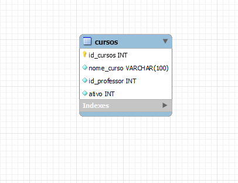

Esta primeira tabela tem os dados do curso, de forma que cada registro incluir o nome do curso, o professor e se o curso está ativo ou não. Cada um dos atributos recebe uma coluna específica e o banco de dados atribui uma ID única (uma chave) a cada linha.

Uma segunda tabela, nosso cadastro de professores contém o nome, dados de contato e um ID exclusivo. 

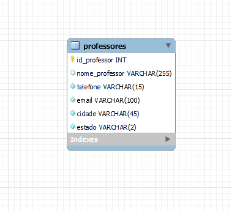

Estas duas tabelas têm uma coisa em comum, alguma sugestão ❓ 

A coluna id_professor é um atributo das duas tabelas. Mas por causa dessa coluna em comum, o banco de dados relacional pode criar uma relação entre as duas tabelas. Dessa forma, quando nossa aplicação requistar o cadastro de um curso, através do código do professor, teremos acesso a suas informações de contato.

O modelo relacional é o melhor em manter a consistência de dados. Por exemplo, quando um cliente deposita dinheiro em um caixa eletrônico e analisa o saldo da conta em um celular, o cliente espera ver esse depósito refletido imediatamente em um saldo atualizado da conta. Os bancos de dados relacionais se destacam nesse tipo de consistência de dados, garantindo que várias instâncias de um banco de dados tenham os mesmos dados o tempo todo.

Os bancos de dados relacionais lidam com regras e políticas de negócios em um nível muito granular, com políticas rígidas sobre compromisso (isto é, fazer uma alteração no banco de dados permanente). Por exemplo, considere um banco de dados de inventário que rastreie três peças que são sempre usadas juntas. Quando uma peça é retirada do inventário, as outras duas também devem ser retiradas. Se uma das três partes não estiver disponível, nenhuma das partes deve ser retirada - todas as três partes devem estar disponíveis antes que o banco de dados assuma qualquer compromisso. Um banco de dados relacional não assumirá o compromisso por uma peça até que saiba que pode confirmar todas as três. Essa capacidade de compromisso multifacetada é chamada atomicidade. A atomicidade é a chave para manter os dados precisos no banco de dados e garantir que eles estejam em conformidade com regras, regulamentos e políticas da empresa.

Quatro propriedades essenciais definem as transações do banco de dados relacional: atomicidade, consistência, isolamento e durabilidade, normalmente denominados ACID.

**A atomicidade** define todos os elementos que compõem uma transação completa do banco de dados.

**A consistência** define as regras para manter os pontos de dados em um estado correto após uma transação.

**O isolamento** mantém o efeito de uma transação invisível para outras pessoas até ser confirmada, para evitar confusão.

**A durabilidade** garante que as alterações de dados se tornem permanentes quando a transação for confirmada.

##  Bancos não relacionais

Também conhecidos como Bancos NoSQL, o banco de dados não relacional é uma forma de processar e organizar um grande volume de dados sem a necessidade de uma estruturação prévia. 

Diferente do que estudamos no módulo anterior, os bancos não relacionais não possuem uma estrutura rígida e estruturada. 

Atualmente, os bancos NoSQL se destacam nos cenários de grande volume de dados, especialmente quando relacionado à nuvem, dispositivos móveis e big data.

OS bancos NoSQL contam com estruturas variadas e organizações sob medida.

Desta forma, eles não se limitam ao modelo de estruturação de dados fixos. 

Atualmente temos quatro modelos que se destacam nas principais aplicações no mercado.

**1. Chave-valor**

Como o próprio nome sugere, o formato chave-valor realiza o pareamento dos dados a partir das chaves e valores a partir da tabela de hash. Este banco de dados de costume ser utilizado quando as chaves identificadas e os valores associados não são.

Armazena um conjunto de dados, seja ele simples ou complexo, identificados por um identificador exclusivo. Apresenta um bom desempenho em aplicações na nuvem. 

Uso mais comum em sessões de usuário, cache e carrinhos de compra.

**Casos de uso:** Twitter, Github, Stakeoverflow entre outros.

**2. Documento**

Uma base de dados orientada a documento gerencia um conjunto de campos com chaves e valores em uma entidade referida como documento. Estes dados armazenam normalmente dados na forma de documentos JSON.

Cada campo referencia um valor que pode ser expresso de várias maneiras, como um número, um objeto, array, uma string ou um outro documento. Os dados nos campos de um documento podem ser codificados de várias maneiras, incluindo XML, YAML, JSON, BSON, ou até mesmo armazenados como texto simples.

Normalmente, um documento contém os dados completos de uma entidade. Os itens que constituem uma entidade são específicos da aplicação. Por exemplo, uma entidade pode conter os detalhes de um cliente, um pedido, ou uma combinação de ambos.

Um único documento poderia conter informações que estariam espalhadas por várias tabelas relacionais em um sistema de gerenciamento de banco de dados relacional (RDBMS). A base de dados do tipo documentos não exige que todos os documentos tenham a mesma estrutura, esta abordagem proporciona uma grande flexibilidade.

O NoSQL mais conhecido de armazenamento de documentos é o **MongoDB.**

Grandes empresas que usam o MongoDB. Por sua versatilidade, performance e segurança, MongoDB é utilizado por grandes empresas como **Rede Globo, Codecademy, Google Search, Foursquare, IBM, Orange S.A., The Gap, Inc., Uber, HSBC, eBay, e Cisco**.

**3. Grafos / Gráfico / Graph**

O banco de dados não relacional do tipo de gráfico utiliza um modelo baseado em nós e bordas que representa os dados interconectados. Deste modo, o armazenamento fica mais complexo, porém igualmente mais detalhado.

Um banco de dados do tipo graph gerencia dois tipos de informações, nós e arestas. Os nós representam entidades, e as arestas especificam as relações entre estas entidades. Ambos, nós e arestas, podem ter propriedades que fornecem informações sobre o nó ou aresta, semelhantes as colunas em uma tabela. As arestas também podem ter uma direção indicando a natureza da relação.

O objetivo de um armazenamento de dados do tipo graph é permitir que uma aplicação execute consultas que atravessam a rede de nós e arestas de forma eficiente, e que permita analisar as relações entre entidades.

Em contraste com os bancos de dados relacionais e NoSQL, os bancos de dados do tipo graph armazenam as relações de dados como relacionamentos. Este armazenamento explícito de dados de relacionamento significa menos desconexões entre seu esquema e seu banco de dados real.

Na verdade, a flexibilidade do modelo de grafos permite adicionar novos nós e relacionamentos sem comprometer sua rede existente ou migrar seus dados de forma demorada. Todos os seus dados e relacionamentos originais permanecem intactos.

O grafo a seguir é um exemplo de grafo de rede social. Considerando as pessoas (nós) e seus relacionamentos (arestas), é possível descobrir quem são os “amigos dos amigos” de uma pessoa específica, por exemplo, os amigos dos amigos de Howard. 

Como exemplo, os bancos de dados de grafos podem fazer uma prevenção sofisticada contra fraudes. Com os bancos de dados de grafos, você pode usar relacionamentos para processar transações financeiras e de compras praticamente em tempo real. Com consultas de grafos rápidas, você pode detectar, por exemplo, se um possível comprador está usando o mesmo endereço de e-mail e cartão de crédito que o usado em um caso de fraude conhecido. Os bancos de dados de grafos também podem ajudá-lo a detectar facilmente padrões de relacionamento, como várias pessoas associadas a um endereço de e-mail pessoal ou várias pessoas compartilhando o mesmo endereço IP, mas residentes em endereços físicos diferentes. 

Os bancos de dados de grafos são uma boa opção para aplicativos de recomendação. Com os bancos de dados de grafos, você pode armazenar em um grafo os relacionamentos entre as categorias de informação, como os interesses, os amigos e o histórico de compras dos clientes. Você pode usar um banco de dados de grafos altamente disponível para fazer recomendações de produtos a um usuário com base em quais produtos foram comprados por outras pessoas que seguem o mesmo esporte e têm histórico de compras similar. Além disso, é possível identificar pessoas com um amigo em comum, mas que ainda não se conhecem, para fazer uma recomendação de amizade. 

fonte: https://aws.amazon.com/pt/nosql/graph/

**4. Colunar (Wide column)**

Por fim, colunar costuma se destacar por o tipo de dados de uma coluna larga, que permite a identificação dos dados de famílias de colunas. Os bancos de dados colunares, como o Amazon Redshift e o Google BigQuery, armazenam a informação coluna-a-coluna, o que permite:

- Maior compressão – já que dados de tipos iguais são armazenados juntos, há uma otimização de espaço utilizado
- Eliminação da necessidade de índices
- Alta-performance para operações de agregação

Os bancos de dados colunares disponíveis no mercado desenvolveram outras otimizações para melhoria de performance, o que os torna ideiais para times de analytics que precisam lidar com grandes bases de dados – principalmente otimização de cruzamentos entre tabelas.

## Modelagem de dados

A modelagem relacional representa o banco de dados a partir de uma coleção de relações para suportar o processamento de transações online (OLTP).

São otimizados para processar consultas que podem afetar uma pequena parte do banco, bem como transações que envolvam inserções e alterações. Em síntese, são projetados para retornar dados únicos em linha. 

A modelagem de dados pode ser dividida em três grupos:

- Modelo conceitual, modelo lógico e modelo físico.

**Modelo de dados conceituais**

Finalidade do modelo conceitual de dados é capturar os requisitos de informação e regras de negócio sob o ponto de vista do negócio.

Para isto, torna-se necessário o entendimento e a correta aplicação dos mecanismos de abstração, utilizados na modelagem conceitual de dados.

Quando pensamos em modelo conceitual, falamos de entidades e seus relacionamentos. 

Abaixo um outro exemplo de modelagem.

**Modelo lógico**

Um modelo de dados lógico é uma representação lógica das informações da área de negócios, não é um banco de dados, é independente do modelo físico.

Este é o conceito chave da modelagem de dados lógica. Ele deve ser independente da tecnologia implementada devido a constante mudança dos produtos tecnológicos.

Não vamos nos estender, já que não é o foco de nosso módulo, mas deixo um link para você explorar mais sobre o tema.

<a href="https://www.devmedia.com.br/por-que-construir-um-modelo-de-dados-logico-parte-i/368#:~:text=Um%20modelo%20de%20dados%20l%C3%B3gico%20%C3%A9%20uma%20representa%C3%A7%C3%A3o,implementada%20devido%20a%20constante%20mudan%C3%A7a%20dos%20produtos%20tecnol%C3%B3gicos." target="_blank"> Modelo lógico << </a>   

**Modelo físico**

Modelos físicos são usados para projetar o esquema interno de um banco de dados, descrevendo as tabelas de dados, as colunas de dados das tabelas e o relacionamento entre as tabelas.

Embora o modelo físico e lógico parecam similares, e de fato são, o nível de detalhes que eles modelam pode ser ser significamente diferente. Isso acontece por que  objetivo de cada diagrama é difetente. O modelo lógico pode ser usado para explorar conceitos de domínio do negócio com os envolvidos no projeto e o modelo físico para definir o projeto do banco de dados.

Na figura abaixo esta diferença poderá ser percebida.

**Figura 1.** Um simples modelo lógico de dados

**Figura 2.** Um simples modelo físico de dados

fonte: https://www.devmedia.com.br/modelagem-de-dados-tutorial/20398

# Criando nosso banco e executando os primeiros comandos

Tá na hora de colocar a mão na massa! Vamos de prática?

Primeiro, abra seu MySQL Workbench, selecione a conexão e vamos partir juntos do painel inicial, semelhante a este abaixo.

No começo do módulo deixamos disponível um vídeo com instalação e instruções iniciais.

Vamos começar criando nosso banco de dados

<code> 
  create database blue;
</code>

Para executar o comando, pode pressionar CTRL + Enter ou clicar nos ícones de raio. 

Na imagem abaixo, em destaque os ícones que executam o código. Um deles executa a linha que está posicionada o cursor e o outro executa todo o código.

Na imagem destacamos também em verde o ícone de "Refresh", vai clicar nele após criar a base de dados para que possa visualizar a base nos Schemas.

Uma dica, caso seu painel esteja com outras opções, confira se se está na opção de Schemas. As vezes o Workbench abre na aba de Administration, na imagem em azul mostro aonde clicar para mostrar o painel de execução de linha de código.

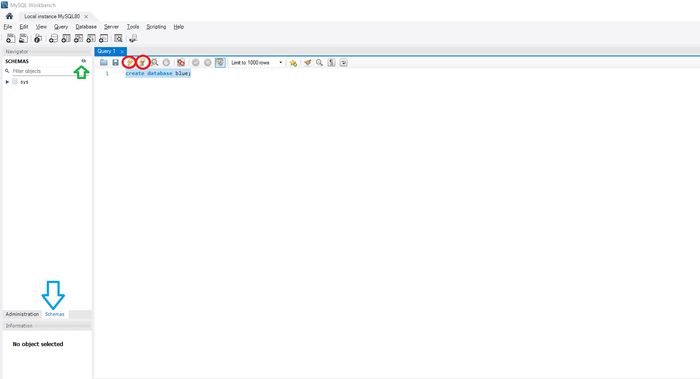

Após criar nosso banco de dados, precisamos indicar que vamos trabalhar com ele. Para isso, utilizamos o código abaixo:

<code>
  use blue;
</code>

Banco inicializado para utilização. Vamos criar a nossa primeia tabela.

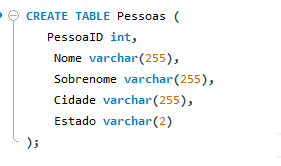

Vamos compreender a sintaxe básica:
- Sempre iniciar com CREATE table nomeDaTabela(), indicando que será criada uma nova tabela;
- Dentro dos parênteses colocamos os atributos(colunas) e ao lado definimos o tipo de dado;
- Para cada nova coluna, devemos colocar uma vírgula indicando o fim dos parâmetros;
- Finalizamos com ";", indicando o fim do script.

Repensando o modelo, optamos em criar uma tabela de pessoa física e outra tabela de pessoa jurídica.

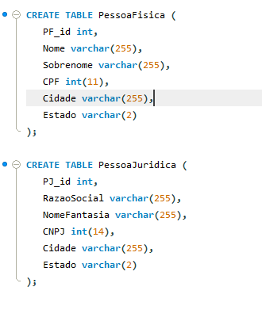

Se você está me acompanhando, deve estar com uma estrutura igual ou semelhante a esta.

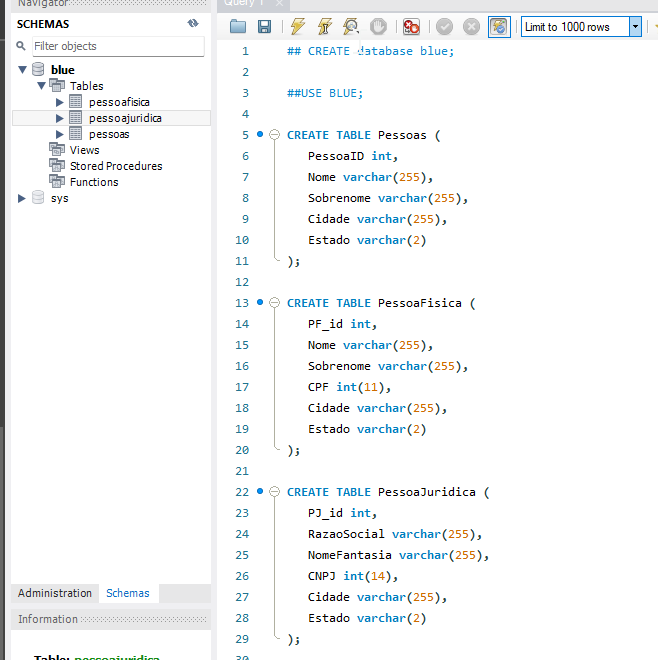

Concorda que a tabela pessoas ficou fora de contexto. Vamos remove-la de nosso modelo.

<code>
  DROP TABLE pessoas;
</code>

O comando DROP faz a remoção. Sua sintaxe é semelhante ao CREATE. Basta informar o tipo de remoção (Table, Database) e o nome do objeto, neste caso, o nome da tabela. 

Ma lembre-se, com grandes poderes vem junto grandes responsabilidade, tome cuidado para não confundir os comandos e acabar removendo Bases ou tabelas por engano.

Vamos avançar em nossos estudos, é hora de inserir dados em nossas tabelas.

A sintaxe básica da inserção de dados é:

- INSERT INTO nomeTabela(nomeColuna) VALUES(valorÚnico);
- o nome da tabela (INSERT INTO nomeTabela);
- ao lado do nome da tabela, abrimos e fechamos parenteses com o nome das colunas que vamos inserir os dados;
- ao lado de values, entre parênteses, informamos um valor único para cada uma das colunas que informamos anteriormente;
- observar a ordem das colunas, o tipo de dado e se existe alguma restrição (ex, o tamanho do campo);

Nosso primeiro INSERT na tabela de Pessoas Físicas

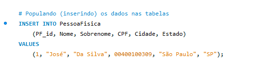

Muito bom, mas se agora quisermos adicionar mais de um registro ao mesmo tempo ❓ 

Podemos aproveitar da mesma estrutura e adicionar o número de registros necessários no mesmo script. Veja no exemplo abaixo.

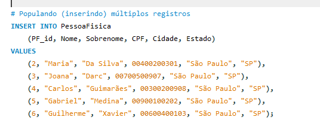

Agora você deve estar se perguntando, aonde está os registros que incluímos ❓

Para que façamos a leitura de dados, utilizamos o famoso SELECT. 

Sua sintaxe básica é:

SELECT (nome das colunas) nomeDaTabela;
Sendo que, quando quisermos retornar todas as colunas da tabela, usamos o "*".

Vamos com um exemplo para ficar mais claro.

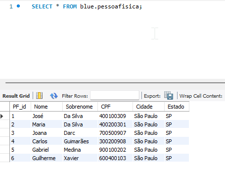

Se correu tudo bem com os seus scripts, o resultado do seu SELECT deve ser semelhante a este.

E se quisermos retornar apenas as colunas nome e CPF ❓

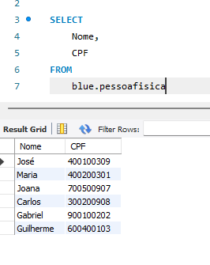

Vamos avançar um pouco ❓ Vou inserir mais alguns dados em nossa tabela.

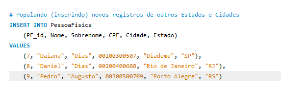

Executando novamente nosso SQL, temos este resultado.

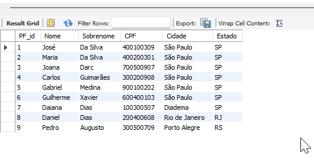

E se quisermos retornar apenas os registros do Estado de SP? Conheça nosso amigo "**WHERE**".

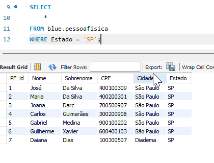

Mas se eu quero todos os registros do estado de SP, mas de fora da capital. Podemoo usar o script abaixo.

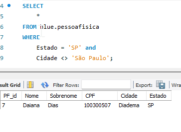

É claro que existem tantas outras formas de chegar ao resultado e que iremos explorar no decorrer do módulo. Mas para este primeiro contato, está excelente!
Fica o convite para inserir novos dados, popular a tabela de Pessoa Jurídica e fazer outras combinações de Where.

Antes de finalizarmos esta aula, gostaria de abordar mais um assunto. E se quisermos atualizar alguma informação? 

Saiba que é possível sim, para isto, usamos o comando UPDATE. 

Sua sintaxe básica é a seguinte:

UPDATE nomedaTabela SET=novoValor WHERE=condicao

Este comando é um pouco mais complexo, extenso e PERIGOSO. Muito importante que você pratique e compreenda bem os poderes do WHERE, para evitar que ocorram manipulações erradas em nosso banco de dados.

Vou executar uma atualização de dados.

Vamos imaginar que a Daiana Dias, CPF 100300507 tenha se mudado para Barueri, vamos atualizar seu cadastro.

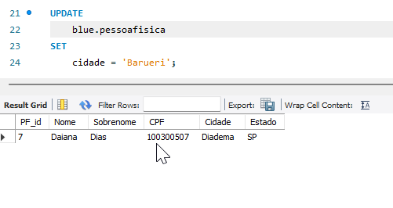

Caso vocÊ execute o comando desta forma, acabaríamos atualizando não apenas o registro da Daiana, mas todos os cadastros seriam afetados.

Uma boa prática é informar um chave primária, em nosso caso, o ID da pessoa para atualização.

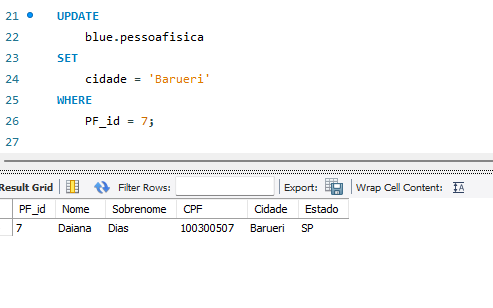

Chegamos ao fim da nossa primeira aula do módulo 4. Abordamos conceitos iniciais de banco de dados. De prática, gostaria que realizassem o DROP das tabelas e repetissem os passos. Criem outras tabelas e colunas pensando em coisas do seu cotidiano, da sua casa, enfim, pratiquem.

Deixo também disponível um Tutorial em que vocês podem praticar e replicar os exemplos criando o seu próprio banco de dados. Visitem e explorem

https://www.w3schools.com/sql/

Até nosso CodLab!
