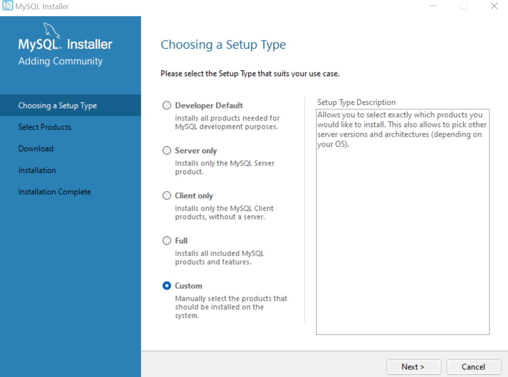

# # Aula 16 - [AULA] SQL - Parte 1

## Conteúdos

1. Conceitos iniciais de bancos de dados

2. Bancos relacionais e não relacionais

3. Modelagem de dados

4. Criando nosso banco e executando os primeiros comandos

## Conceitos iniciais de bancos de dados

Bem-vindo ao módulo 4. Parabéns pela jornada. 

Nesta semana vamos tratar de um tema muito interessante. O nosso querido "SQL". Será uma semana muito legal, cheia de desafios e aprendizado.

Os exemplos utilizados foram realizados e capturados no MySQL Workbench. Segue o link para download (https://dev.mysql.com/downloads/mysql/).

Procure pelo MySQL Workbench na versão Community.

Na instalação, recomendamos selecionar o tipo Custom, para selecionarmos os produtos que vamos instalar. 

:exclamation:Você irá encontrar nos documentos complementares orientações de instalação.

Quando falamos de Banco de dados, precisamos voltar aos registros físicos de bibliotecas. Pense nos negócios em geral, registros policicais, fichas de pacientes, registros de estoque e também entradas e saídas de pessoas e materiais em um prédio ou pavilhão. Esse resgate é importante, pois foi lá que tudo começou.

Estes registros eram individualizados, mantinha-se um histórico muito longo de informações e também uma metodologia de indexação e recuperação da informação quando se precisava dela. Mas não vamos nos alongar muito, mas fica o convite para quem quiser pesquisar mais sobre o assunto. 

Os Bancos de dados como conhecemos hoje, o modelo relacional, é uma teoria matemática desenvolvida por Edgar Frank Codd. Ele desceve como as beses de dados devem funcionar. E veja bem, estamos falando de de um período entre 1960-1970. 

Mas me conta aí, você sabia disso :bowtie: ? 

Caso queira conhecer um pouco mais sobre o criado do modelo relacional, pode começar por aqui: :arrow_right: <a href="https://pt.wikipedia.org/wiki/Edgar_Frank_Codd" target="_blank"> Edgar Frank Codd </a>

Bancos de dados ou bases de dados são conjuntos de arquivos relacionados entre si com registros sobre pessoas, lugares ou coisas. São coleções organizadas de dados que se relacionam de forma a criar algum sentido (informação). São de vital importância para empresas e se tornaram a principal peça dos sistemas de informação e segurança.

:pushpin: Agora um ponto de reflexão para debatermos em aula! 

Quando falamos em Dados e informações. Estou falando a mesma coisa❓

Os bancos de dados são operados pelos Sistemas Gerenciadores de Bancos de Dados (SGBD), que surgiram na década de 1970. Outro tipo notável é o SGBD Orientado a Objetos, implementado em bancos dados com estruturas complexas ou aplicações que mudam constantemente.

Por volta de 1976, o Dr. Peter Chen propõe o modelo Entidade-Relacionamento (ER) para objetos de bancos de dados, dando uma nova e importante percepção dos conceitos de modelos de dados. 

Na metodo dos anos 80, a linguagem de SQL se torna um padrão mundial :grin:.

Pela metade dos anos 90 começa a explosão das vendas na Internet (sim, houve um tempo que não existia a Internet :smile:).

Processos de transação de tempo real (OLTP - On-Line Transaction Process) e processos analíticos em tempo real (OLAP - On-Line Analitical Process) atigem maturidade através de muitos negócios utilizando pontos de venda.

Recapitulando para você não se perder, ok? :bulb:

Partimos de fichas e registros individuais até a organização em arquivos.
Começamos a estruturar e indexar estes dados.
Seguimos com o modelo relacional, lembra do Edgar Codd, né?
Chegamos no modelo Entidade-Relacionamento do Dr. Peter Chen!
Victory 💪! SQL se torna um padrão mundial.
Até aqui, nossos dados estão de certa forma "isolados" dentro nosso ambiente corporativo.

Depois vem o :boom: da internet. Os dados começam a circular e precisamos repensar o modo de armazenar, transitar e dar segurança a estes dados.

Os dados começam a ser cruzados. Do ponto de vista de um negócio, tenho vendas presenciais e OnLine. Posso também ter várias lojas, como consolidar as vendas e o estoque de todas elas? 

Além disso, meus clientes estão indo pra internet. Por que não sugerir produtos com base em suas preferências? Vai dizer que nunca pensou sobre isso? Você pesquisa sobre algo na internet e logo após, como num passe de mágica, chuva de ofertas sobre o produto que você pesquisou!

A questão é que isso gera um volume incalculável de dados. Se antes eu tinha um "controle" do meu volume de dados e que tipo de informação seria armazenada no meu Banco de dados, quanto incluímos a "Internet", as coisas mudarem completamente.

Quais as tendências :confused: ❓

Sistemas gigantescos (na casa dos Terabytes) já são realidade e novos recursos são necessários para manipulação e análise dos dados.

Data mining(mineraçaõ de dados), Data WareHouse, Data Marts, Data Lake são técnicas atualmente utilizados. Sistemas de compras inteligentes e recomendações baseado em dados. 

Ufa! Bastante conteúdo teórico. Mas é importante refletir e pensar sobre a evolução e de que como chegamos até aqui. 
