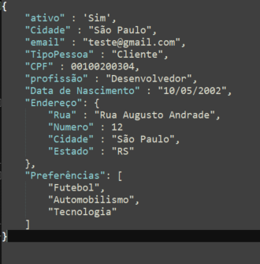
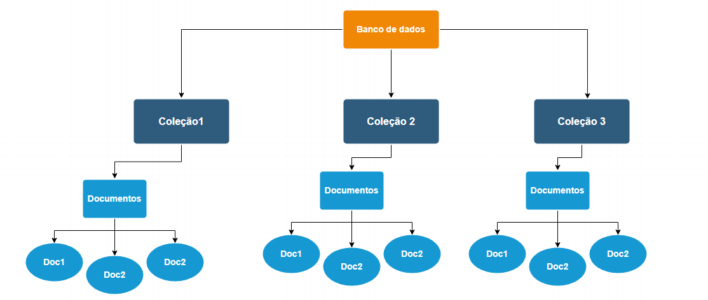
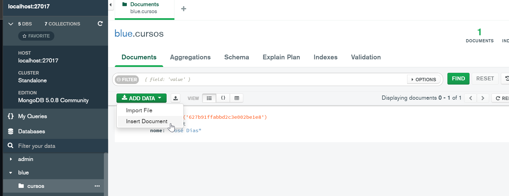
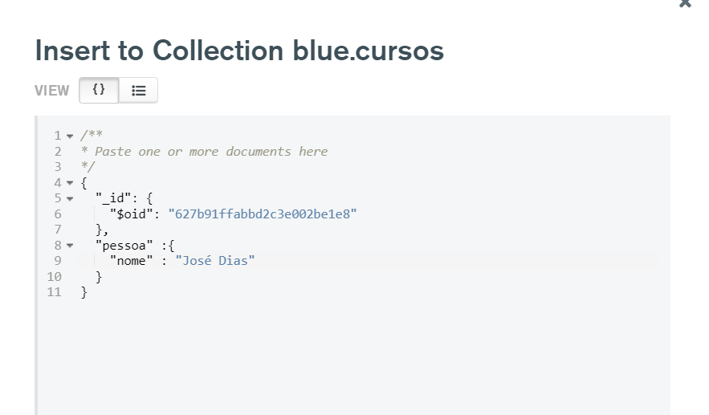

# # Aula ?? - [NoSQL] SQL - Parte 1

## Conteúdos

1. Bancos NoSQL: Diferenças dos bancos relacionais

2. Conceitos de banco de documentos

3. Coleções e campos

4. MongoDB

5. MongoDB: Como funciona

6. MongoDB: Criando Database e collections

7. MongoDB: Select e filtros
 

## Bancos NoSQL: Diferenças dos bancos relacionais

E vamos pra nossa aula de NoSQL! Você já conhecia este termo?

Quando falamos de **NoSQL**, o que lhe vêm a cabeça? Diferente do que muita gente pensa a primeira vez que vê o termo, NoSQL não quer dizer "NO SQL", ou então, "sem SQL". 

Muito pelo contrátio, o termo **NoSQL** ao ler a tratar sobre bancos de dados não relacionais significa **"Not only SQL"**, "não apenas SQL", trata-se de um termo bastante flexível. Inclusive, alguns bancos de dados não relacionais dão suporte a uma versão do SQL (Structured Query Language) adaptada para documentos em vez de tabelas, o que facilita a operação por parte dos profissionais que conhecem o SQL.

Enquanto os bancos relacionais armazenam apenas dados estruturados, os bancos NoSQL proporcionam armazenamento de dados semi-estruturados ou não estruturados. Arquivos JSON, XML, são exemplos de arquivos armazenados em estruturas NoSQL.

Os bancos de dados **NoSQL** são amplamente usados em aplicativos da web em tempo real e big data, porque suas principais vantagens são alta escalabilidade e alta disponibilidade.

Os bancos de dados **NoSQL** também são a escolha preferida dos desenvolvedores, pois eles naturalmente aceitam um paradigma de desenvolvimento ágil, adaptando-se rapidamente aos novos requisitos. Como vimos na primeira aula deste módulo, um banco relacional necessita de modelagem dos dados, isso significa estabelecer previamente os atributos e qual o tipo de dado será aceito. Diferente de um banco não relacional, que rapidamente poderá migrar para outros atrinutos.

Os bancos de dados NoSQL permitem que os dados sejam armazenados de maneiras mais intuitivas e fáceis de entender, ou mais próximas da maneira como os dados são usados pelos aplicativos - com menos transformações necessárias ao armazenar ou recuperar usando APIs no estilo NoSQL. Além disso, os bancos de dados NoSQL podem aproveitar ao máximo a nuvem para oferecer tempo de inatividade zero.

Para entender os bancos de dados NoSQL, é importante saber qual é a diferença entre RDBMS e tipos não relacionais de bancos de dados.

Os dados em um RDBMS são armazenados em objetos de banco de dados que são chamados de tabelas. Uma tabela é uma coleção de entradas de dados relacionadas e consiste em colunas e linhas. Esses bancos de dados requerem a definição do esquema com antecedência, ou seja, todas as colunas e seus tipos de dados associados devem ser conhecidos de antemão para que os aplicativos possam gravar dados no banco de dados. Eles também armazenam informações vinculando várias tabelas por meio do uso de chaves, criando assim um relacionamento entre várias tabelas. No caso mais simples, uma chave é usada para recuperar uma linha específica para que ela possa ser examinada ou modificada.

Por outro lado, em bancos de dados NoSQL, os dados podem ser armazenados sem definir o esquema com antecedência—o que significa que você tem a capacidade de se mover e iterar rapidamente, definindo o modelo de dados à medida que avança. Isso pode ser adequado para requisitos específicos de negócios, seja baseado em gráficos, orientado a colunas, orientado a documentos ou como um armazenamento de valor-chave.

Até muito recentemente, os bancos de dados relacionais eram os modelos mais usados. Eles ainda são extremamente onipresentes em muitas empresas; no entanto, a variedade, velocidade e volume de dados que estão sendo acessados hoje às vezes requerem um banco de dados muito diferente para complementar o banco de dados relacional. Isso desencadeou a adoção em algumas áreas dos bancos de dados NoSQL—também chamados de "bancos de dados não relacionais". 

## Conceitos de banco de documentos

Como estudamos na aula 1, está bem difundido na comunidade quatro tipos de bancos não relacionais. Relembrando:
- Orientado a chave valor, orientado a coluna, orientado a Grafos e orientado a documentos.

Nesta aula, vamos aprofundar os conhecimentos no conceito de bancos orientados a documentos. 

Um banco orientado a documentos é um tipo de banco projetado para armazenar dados semi-estruturados, geralmente, em formato JSON, XML ou YARN.

Um documento é uma maneira de organizar e armazenar dados como um conjunto de pares de valor de campo. Assim, onde o campo é um identificador único para algum ponto de dados, e o valor são dados relacionados a um determinado identificador.

Neste exemplo, temos um campo "Name" e o valor "Ada Comptom".

Analisaremos mais de perto documentos e suas estruturas assim que colocarmos as mãos em um conjunto de dados real.

Mas, por enquanto, este é um exemplo simples de um documento.

Diferente dos bancos relacionais, o Schema de cada documento não relacional pode variar, o que nos oferece maior flexibilidade para organizar e armazenar dados, reduzir o armazenamento exigido para valores opcionais e maior agilidade na recuperação dos dados.

**E qual a aplicação de um banco orientado a documentos ❓**

Bancos relacionais geralmente armazenam dados em tabelas separadas. Um único objeto pode estar espalhado através de várias tabelas.

Em um banco orientado a documentos, podemos armazenar todas as informações em um único objeto. Abaixo um exemplo no formato JSON:

Os documentos armazenados são fortemente equivalentes ao conceito de objeto em programação. Eles não são obrigados a aderir a um esquema padrão, nem precisarão ter todas as mesmas seções, aberturas, partes ou chaves.

Cada objeto, mesmo aqueles da mesma classe, podem parecer muito diferentes.

Concluindo, como não é necessário definir nenhum esquema rígido antes de realmente usar o banco de dados, já que todos os dados e metadados estão no próprio documento, se for necessário incluir um novo campo, poderá inclui-lo sem afetar de forma adversa outros documentos do banco de dados. Além disto, os documentos não precisam armazenar os campos vazios.

## Coleções e campos

As coleções em bancos no NoSQL, de forma didática, podemos assimilar a tabelas de um banco relacional. Basicamente, a coleção é um agrupamentos de documentos.

Os documentos dentro de uma coleção podem ter diferentes campos. Um banco de dados possui uma ou mais coleções.

Os campos de um documento, como tratamos em nosso módulo, são os dados contidos no documento. Diferente dos bancos relacionais, não possuem uma Schema pré-definido.

O banco de dados não relacional mais conhecido e difundido na comunidade é o MongoDB. Justamente por ser orientado a documentos é que vamos utiliza-lo em nossa aula daqui para frente.

## MongoDB

MongoDB é um software de banco de dados orientado a documentos livre, de código aberto e multiplataforma, escrito na linguagem C++. Classificado como um programa de banco de dados NoSQL, o MongoDB usa documentos semelhantes a JSON com esquemas. É desenvolvido pela MongoDB Inc.

Suas características permitem com que as aplicações modelem informações de modo muito mais natural, pois os dados podem ser aninhados em hierarquias complexas e continuar a ser indexáveis e fáceis de buscar.

O desenvolvimento de MongoDB começou em outubro de 2007 pela 10gen, atual MongoDB Inc., e sua primeira versão pública foi lançada em fevereiro de 2009.

Curiosidade, em 20 de outubro de 2017, MongoDB se tornou uma empresa pública, listada no NASDAQ como MDB.

O MongoDB é o mais popular banco de dados NoSQL, utilizamento mundialmente por grandes empresas e projetos.

Segue o link da documentação oficial, incluindo a instalação. 
Obs: O MongoDB possui a versão Online, caso optem por não realizar a instalação. O curso será abordado na versão Desktop, para simplificar. 

https://www.mongodb.com/docs/guides/server/install/

Segue um vídeo explicativo da instalação em Windows

https://www.youtube.com/watch?v=N1RBcp74pi0

## MongoDB: Como funciona

É um banco de dados com escalabilidade e flexibilidadeO MongoDB, trabalha com o conceito de documentos através de consultas e indexação dos dados.

Por DEFAULT, o MongoDB não exige um Schema, mas saiba que em tópicos mais avançados, pode ser feito uma modelagem dos dados, caso o projeto assim exiga.

MongoDB armazena dados em documentos do tipo JSON flexíveis, o que significa que os campos podem variar de documento para documento e a estrutura de dados pode ser alterada ao longo do tempo.

Consultas ad hoc, indexação e agregação em tempo real fornecem maneiras poderosas de acessar e analisar seus dados.

MongoDB é um banco de dados distribuído em seu núcleo, de modo que a alta disponibilidade, a escala horizontal e a distribuição geográfica são incorporadas e fáceis de usar.

MongoDB é gratuito. As versões publicadas antes de 16 de outubro de 2018 são publicadas sob a AGPL. Todas as versões lançadas após 16 de outubro de 2018, incluindo correções de remendos para versões anteriores, são publicadas sob a Licença Pública do Lado do Servidor (SSPL) v1.

## MongoDB: Criando Database e collections

Seguindo a instalação local do MongoDB, você deve ter instalado uma plataforma gráfica chamada **MongoDB Compass**.

Ao abrir faça a conexão e vamos começar realizar nossos primeiros comandos.

Vamos começar criando um Database. Vou usar o nome de **Blue**. Já vou aproveitar e criar nossa primeira collection com o nome de **cursos**.

Após criar nosso database e nossa collection, no Menu a esquerda já estará disponível para trabalharmos.

Vou inserir meu primeiro documento, para isto, clique em **""ADD DATA""** >> Insert Document.

Será aberto a tela de formatação para inclusão do documento.

Muito bom! Criamos nossa estrutura básica. Documento, collection e Database. Seguiremos criando novos documentos para avançarmos a parte final de filtros e agregações.

## MongoDB: Select e filtros

