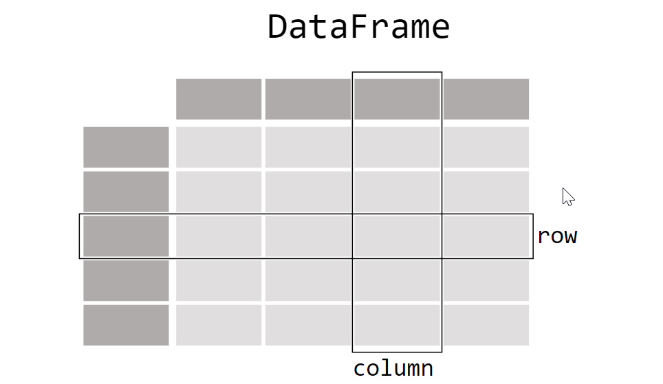
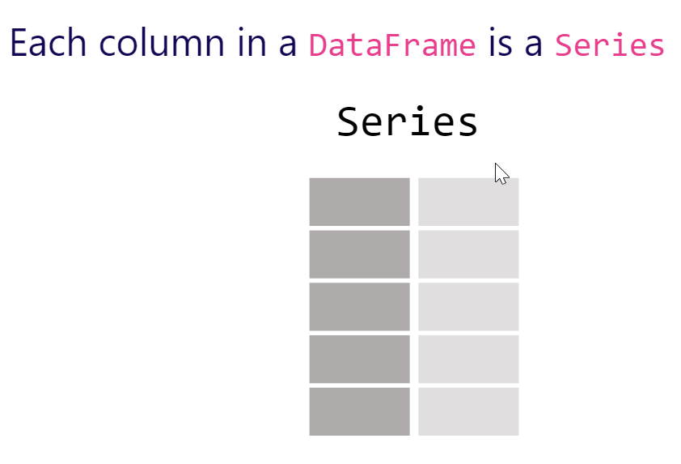

# Pandas

Biblioteca mais utilizada para análise e manipulação de dados. 

Documentação oficial: https://pandas.pydata.org/pandas-docs/stable/index.html#

O dia a a dia de um profissional da área de dados consiste em coletar informações, armazenar, manipular e analisar os dados. E como veremos no decorrer da aula, esta bibliotea é perfeita para estes trabalhos.

Principais características e funcionalidades da biblioteca Pandas:

* Biblioteca usada para manipar e analisar dados;
* Realizar limpeza, filtragem e agregação de dados;
* Usando o pandas podemos ler dados de diferentes formatos de arquivos;
* Pandas é de fácil aprendizado;
* O Pandas possui uma extensa comunidade ativa;
* Os principais conceitos são: DataFrames e Series.

As duas estruturas primárias de dados de pandas, Series (1-dimensional) e DataFrame (bidimensionais), lidam com a grande maioria dos casos típicos de uso em finanças, estatísticas, ciências sociais e muitas áreas de engenharia

<h2> DataFrames </h2>

<h2> Series </h2>

Aqui estão apenas algumas das coisas que pandas fazem bem:

* Fácil manuseio de dados perdidos (representados como NaN) em ponto flutuante, bem como dados de pontos não flutuantes;
* Mutabilidade de tamanho: colunas podem ser inseridas e excluídas do DataFrame, sem modificar os dados orgiginais;
* Ordenação automático e explícito de dados: os objetos podem ser explicitamente ordenados em um conjunto de rótulos;
* Grupo poderoso e flexível por funcionalidade para para agregar e transformar dados;
* Facilite a conversão de dados irregulares e indexados de forma diferente em outras estruturas de dados Python e NumPy em objetos DataFrame;
* Remodelagem flexível do conjuntos de dados;
* Ferramentas robustas de IO para carregar dados de arquivos planos (CSV e delimitados), arquivos Excel, bancos de dados e salvar / carregar dados do formato HDF5 ultrarrápido.

Muitos desses princípios estão aqui para abordar as deficiências frequentemente experimentadas usando outras línguas / ambientes de pesquisa científica. Para os cientistas de dados, trabalhar com dados é tipicamente dividido em múltiplas etapas: obtenção e limpeza de dados, analisando/modelando-os, em seguida, organizando os resultados da análise em um formulário adequado para plotagem ou exibição tabular. O pandas é a ferramenta ideal para todas essas tarefas.

Um DataFrame é o nome da estrutura que o Pandas dá uma tabela. Se você já viu uma tabela do Excel ou de bancos de dados, você sabe o que é um Dataframe. Sua composição básica são linhas e colunas.

As colunas são interpretadas no Pandas como Series. Que nada mais são do que estruturas muito similares a listas.

Podemos pensar nos DataFrames como um arquivo xls, uma planilha do Excel, ou até mesmo uma tabela de um banco de dados, Essa estrutura de dados bidimensional é composta por três elementos principais: linhas, colunas e índices.

:exclamation: Nota: Nos DataFrames, temos índices nas linhas e também nas colunas.

Cada uma das colunas de um DataFrame é uma série.
Tanto as Series quanto os DataFrames possuem funções específicas! A boa notícia é que veremos muitas delas hoje :wink:
