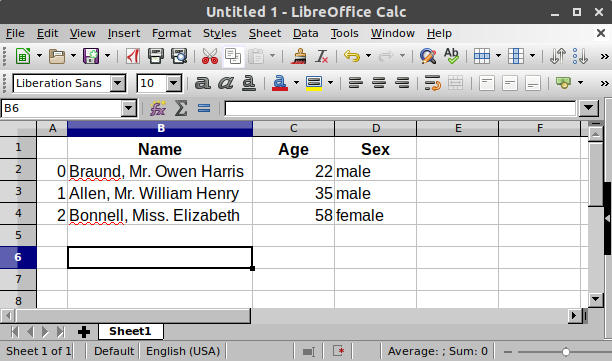

# 2.1 Começando com o Pandas

Para começar a usar o Pandas, primeiro precisamos importar sua bilioteca no Python.

~~~
import pandas as pd
~~~

Para carregar o pacote pandas e começar a trabalhar com ele, importe o pacote. A comunidade concordou que o alias dos pandas é pd. Na prática padrão para toda a documentação dos pandas irá encontrar este alias.

Vamos armazenar os dados dos passageiros do Titanic. Para um número de passageiros, eu sei o nome (personagens), idade (inteiros) e dados de sexo (masculino/feminino).

~~~
df = pd.DataFrame(
    {
        "Name": [
            "Braund, Mr. Owen Harris",
            "Allen, Mr. William Henry",
            "Bonnell, Miss. Elizabeth",
        ],
        "Age": [22, 35, 58],
        "Sex": ["male", "male", "female"],
    }
)
~~~

Podemos armazenar manualmente dados em uma tabela, criando um. Ao usar um dicionário Python de listas, as chaves do dicionário serão usadas como cabeçalhos de coluna e os valores em cada lista como valor nas colunas do DataFrame.

Um DataFrame é uma estrutura de dados bidimensional que pode armazenar dados de diferentes tipos (incluindo caracteres, inteiros, valores de pontos flutuantes, dados categóricos e muito mais) em colunas. É semelhante a uma planilha, uma tabela SQL ou a em R.data.frame.

A tabela tem 3 colunas, cada uma delas com um rótulo de coluna. Os rótulos da coluna são, respectivamente: Name, Age, Sex.

No software de planilha, a representação da tabela de nossos dados seria muito semelhante:

## Trabalhando com subconjuntos

E se quisermos trabalhar com os dados da coluna Age

~~~
df["Age"]
~~~

Ao selecionar uma única coluna de um DataFrame pandas, o resultado é uma série pandas. Para selecionar a coluna, use o rótulo da coluna entre os colchetes. 

